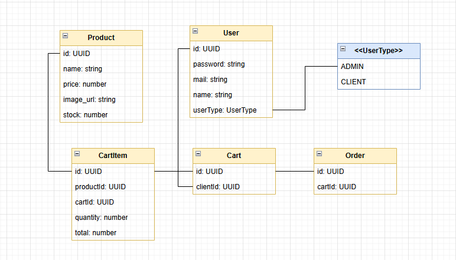

# 🛒 API Carrinho com Estoque Reativo - Desafio Taller

Este projeto implementa o **Desafio 1 – Carrinho com Estoque Reativo** do processo seletivo da Taller, uma API REST para gerenciar produtos e carrinhos de compra com controle rigoroso de estoque.

## 📋 Sobre o Desafio

O desafio consiste em desenvolver uma API que permita:
- Criar produtos com estoque inicial
- Criar carrinhos de compra
- Adicionar/remover produtos ao carrinho
- Finalizar compra (decrementando estoque)
- Impedir finalização com estoque insuficiente
- Controle de concorrência para evitar problemas de estoque
- Autenticação e autorização de usuários

## 🏗️ Arquitetura da Aplicação



A aplicação foi estruturada seguindo os princípios de arquitetura limpa e modular:

### Decisões Arquiteturais

**Framework e Tecnologias:**
- **NestJS:** Framework Node.js robusto com TypeScript nativo, decorators e injeção de dependência
- **Prisma:** ORM moderno para TypeScript com type-safety e migrations automáticas
- **PostgreSQL:** Banco de dados relacional para garantir consistência ACID
- **JWT:** Autenticação stateless com tokens seguros
- **MinIO:** Armazenamento de objetos para upload de imagens dos produtos
- **Swagger/OpenAPI:** Documentação automática da API

**Estrutura Modular:**
```
src/
├── modules/          # Módulos de domínio
│   ├── auth/         # Autenticação e autorização
│   ├── user/         # Gestão de usuários
│   ├── product/      # Gestão de produtos
│   ├── cart/         # Gestão de carrinhos
│   ├── cart-item/    # Itens do carrinho
│   └── order/        # Pedidos finalizados
└── shared/           # Módulos compartilhados
    ├── prisma/       # Configuração do banco
    └── s3/           # Serviço de upload
```

**Controle de Concorrência:**
- Utilização de transações do Prisma com nível de isolamento `Serializable`
- Verificação de estoque dentro das transações
- Uso de `updateMany` com condições para evitar race conditions

**Sistema de Autorização:**
- **AdminGuard:** Acesso apenas para administradores
- **OwnResourceGuard:** Usuários só podem acessar seus próprios recursos
- **Public:** Rotas públicas sem autenticação

## 📚 Documentação da API

A documentação interativa da API está disponível através do Swagger:

**URL da Documentação:** `http://localhost:3001/api/docs`

O Swagger fornece:
- Especificação completa de todos os endpoints
- Schemas dos DTOs e respostas
- Interface para testar as rotas diretamente
- Exemplos de requests e responses

## 🚀 Como Executar o Projeto

### Pré-requisitos
- Node.js (versão 18+)
- Docker e Docker Compose
- Git

### 1. Clone o Repositório
```bash
git clone git@github.com:DenilsonMelo/challenge-taller-api.git
cd taller-api
```

### 2. Instale as Dependências
```bash
npm install
```

### 3. Configure o Ambiente

Para facilitar a avaliação, o arquivo `.env` foi incluído no repositório com configurações de desenvolvimento.

**Em produção, sempre:**
- Mantenha o `.env` no `.gitignore`
- Configure variáveis diretamente no ambiente de deploy

### 4. Execute a Infraestrutura
```bash
# Inicia PostgreSQL e MinIO via Docker
docker-compose up -d
```

### 5. Configure o Banco de Dados
```bash
# Executa as migrations
npx prisma migrate dev
```

### 6. Inicie a Aplicação
```bash
# Desenvolvimento
npm run start dev
```

A API estará disponível em `http://localhost:3001`

### 7. Usuário Administrador

A aplicação já possui um usuário administrador pré-cadastrado para facilitar os testes:

**Credenciais do Admin:**
```
Email: admin@taller.com
Senha: admintaller
```

### 8. Acesse a Documentação
Visite `http://localhost:3001/api/docs` para explorar a API via Swagger.

## 🖥️ Frontend

Foi desenvolvida uma aplicação frontend para consumir esta API, proporcionando uma interface completa para testar todas as funcionalidades.

**Repositório do Frontend:** [https://github.com/DenilsonMelo/challenge-taller-front](https://github.com/DenilsonMelo/challenge-taller-front)

O frontend inclui:
- Interface de autenticação
- Catálogo de produtos
- Carrinho de compras interativo
- Gestão de estoque em tempo real

## 🛡️ Funcionalidades de Segurança
- Autenticação JWT com expiração configurável
- Hash de senhas com bcrypt
- Autorização baseada em roles (ADMIN/CLIENT)
- Validação de dados com class-validator
- Proteção de recursos por proprietário
- Controle de concorrência no estoque

## 📝 Considerações Finais
Esta implementação demonstra:
- **Arquitetura escalável** com separação de responsabilidades
- **Controle rigoroso de estoque** com prevenção de race conditions
- **Segurança robusta** com autenticação e autorização adequadas
- **Documentação completa** com Swagger
- **Boas práticas** de desenvolvimento com TypeScript e NestJS
